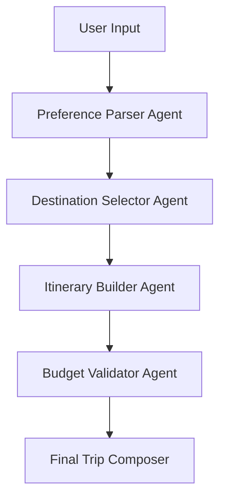

# 🧭 Trip Planner Agent

A modular, agentic AI-powered travel assistant that helps users plan personalized trips with dynamic itinerary generation, budget optimization, and real-time recommendations. Built for extensibility and integration into larger agent workflows.

---

## 🚀 Features

- **🗺️ Destination Discovery**: Suggests travel spots based on user preferences such as climate, activities, and budget.  
- **📅 Itinerary Generation**: Creates day-by-day plans including activities, travel time, and rest periods.  
- **💸 Budget Estimation**: Calculates estimated costs for transport, lodging, food, and experiences.  
- **🧠 Agentic Reasoning**: Uses CrewAI-style modular agents for location selection, budget validation, and itinerary refinement.  

---

## 🧩 Agent Architecture

## 📌 How It Works

1. **User Input**: Collects user preferences including destinations, travel dates, budget, and activity interests.  
2. **Preference Parsing**: The Preference Parser Agent interprets the input into actionable data.  
3. **Destination Selection**: The Destination Selector Agent recommends suitable travel spots.  
4. **Itinerary Building**: The Itinerary Builder Agent generates a day-by-day travel plan.  
5. **Budget Validation**: The Budget Validator Agent estimates costs and ensures the plan fits the user’s budget.  
6. **Final Trip Composition**: The final personalized itinerary is composed and presented to the user.  

---

## 📚 Future Enhancements

- Voice interface for conversational planning  
- Multi-user itinerary collaboration  
- Integration with calendar and email  
- Offline itinerary export (PDF/ICS)  

---

## 🔗 Extensibility

The modular architecture allows easy integration into larger workflows or additional agents for:  

- Real-time travel alerts  
- Personalized activity recommendations  
- Multi-destination trip planning  
- Integration with booking APIs  
## 👤 Author

Built by **Sohan Kumar Shah** — Final-year B.Tech CSE student passionate about agentic AI workflows and modular system design.  

*Made with ❤️ and AI.*
